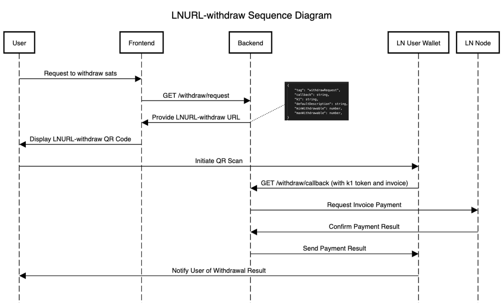

# SATS to GO! - MVP Overview

SATS to GO!, a platform designed to reward punctuality with satoshis in the context of event attendance.
Users can log in, engage with the event, and earn satoshis as a reward for early attendance.

## Development Scope for MVP

- **No Event CRUD Operations**: There is no need to create, read, update, or delete events for the MVP phase, simplifying the development process.
- **Universal Event Eligibility**: All users are considered eligible to attend the featured event without any administrative requirements.
- **LNURL-auth**: Users will log in using LNURL-auth for secure access.
- **LNURL-withdraw**: Users will withdraw rewards via LNURL-withdraw, directly to their wallets.

## LN Service Integration Guide

This guide details the flows for LNURL-auth and LNURL-withdraw, enabling users to authenticate with their Lightning Network wallets and withdraw satoshis from our service.

## Table of Contents
- [LNURL-auth Authentication Flow](#lnurl-auth-authentication-flow)
- [LNURL-withdraw Flow](#lnurl-withdraw-flow)
- [Backend API Endpoints](#backend-api-endpoints)
- [LN Node Integration](#ln-node-integration)

---

## LNURL-auth Authentication Flow

Authentication flow using LNURL-auth. This flow allows users to authenticate using their Lightning Network wallets.

### Sequence Diagram for Authentication

### Flow Description

#### 1. User Requests to Log In
- The user initiates the login process through the frontend interface.

#### 2. Frontend Requests LNURL-auth URL
- The frontend makes a GET request to the backend's `/auth` endpoint to retrieve the LNURL-auth URL.

#### 3. Backend Generates LNURL-auth URL
- The backend generates a unique `k1` token.
- It then creates an LNURL-auth URL containing this `k1` token.

#### 4. Frontend Provides LNURL-auth URL
- The backend sends the LNURL-auth URL to the frontend.

#### 5. Frontend Displays LNURL-auth QR Code
- The frontend displays the LNURL-auth QR code to the user.

#### 6. User Initiates QR Scan
- The user scans the QR code using their Lightning Network (LN) wallet application.

#### 7. LN Wallet Sends Signed Message to Backend
- The LN wallet signs the `k1` token with the user's private linking key.
- It sends the signed message and `k1` token to the backend's `/auth/verify` endpoint.

#### 8. Backend Verifies the Signature
- The backend verifies the signature against the `k1` token.
- If the signature is valid, the backend authenticates the user.

#### 9. Backend Sends Authentication Status to Frontend
- The backend sends a response to the frontend indicating the authentication status.

#### 10. Frontend Notifies the User
- The frontend notifies the user of the authentication result.

---

## LNURL-withdraw Flow

This section describes the sequence of events for a user to withdraw satoshis using LNURL-withdraw.

### Sequence Diagram for Withdrawal

### Flow Description

#### 1. User Requests Withdrawal
- The user navigates to the withdrawal section and requests to withdraw satoshis.

#### 2. Frontend Requests Withdrawal URL
- The frontend makes a GET request to the backend's `/withdraw/request` endpoint for an LNURL-withdraw URL.

#### 3. Backend Generates LNURL-withdraw URL
- The backend generates a unique `k1` token and an LNURL-withdraw URL containing the `k1` token and withdrawal details.

#### 4. Frontend Provides LNURL-withdraw URL
- The backend sends the LNURL-withdraw URL to the frontend.

#### 5. Frontend Displays LNURL-withdraw QR Code
- The frontend displays the LNURL-withdraw QR code for the user to scan.

#### 6. User Initiates QR Scan
- The user scans the QR code using their LN wallet, which is configured to understand and act on LNURL-withdraw QR codes.

#### 7. LN Wallet Sends Callback Request
- The LN wallet sends a callback request to the backend's `/withdraw/callback` endpoint with the `k1` token and a Lightning invoice.

#### 8. Backend Requests Invoice Payment
- The backend validates the `k1` token and requests the LN node to pay the provided invoice.

#### 9. LN Node Confirms Payment Result
- The LN node processes the invoice payment and confirms the result to the backend.

#### 10. Backend Sends Payment Result
- The backend communicates the result of the payment to the LN wallet.

#### 11. LN Wallet Notifies User
- The LN wallet notifies the user of the result of the withdrawal attempt.

---

## Backend API Endpoints

Below are the required backend endpoints needed to support the LNURL-auth and LNURL-withdraw flows. Each endpoint should be implemented according to the provided specifications and should handle the requests and responses as per LNURL protocol standards.

### LNURL-auth Endpoints

#### /auth
- **Method**: GET
- **Description**: This endpoint is used to generate the LNURL-auth URL with a unique `k1` token. It should provide the frontend with the necessary data to display the LNURL-auth QR code to the user.

#### /auth/verify
- **Method**: GET
- **Description**: This endpoint receives the `k1` token and the signed message from the LN wallet. It verifies the signature and authenticates the user session. A successful verification should return an authenticated status, while a failure should return an error.

### LNURL-withdraw Endpoints

#### /withdraw/request
- **Method**: GET
- **Description**: When invoked, this endpoint creates a new LNURL-withdraw request with a unique `k1` token and the withdrawal details. It responds with an LNURL-withdraw URL for the frontend to convert into a QR code.

#### /withdraw/callback
- **Method**: GET
- **Description**: This endpoint handles the withdrawal attempt from the user's LN wallet. It expects the `k1` token and a Lightning invoice as parameters. After validating the `k1` token, it processes the invoice for payment through the LN node.

### Note
Refer to the [LNURL protocol specifications](https://github.com/fiatjaf/lnurl-rfc) for detailed information on request and response structures.

## LN Node Integration

The LN node is a crucial component that interacts with the backend to process payments. It should expose an API that the backend can use to:

- Pay Lightning invoices received from the user's LN wallet.
- Handle other LN transactions as required by the LNURL protocols.

### Implementation Notes 
- Securely generate and manage `k1` tokens, ensuring they are unique and single-use.

---
